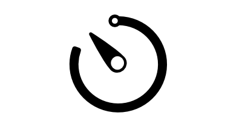

# self-timer.js <small>1.6.1</small>



Date based callback runner library for Javascript


## About
**self-timer.js** は、指定した日時や曜日、時間帯にコールバックを走らせる 軽量のJavascriptライブラリです。

self-timer.jsを使うと、`"月曜日 〜 金曜日の8:00 〜 17:00に指定した処理を実行する"` なんてことが 簡単に書けるようになります。

## Installation

```bash
# npm
npm install self-timer --save
```

```bash
# yarn
yarn add self-timer
```

```html
CDN

<!-- callback  -->
<script src="https://unpkg.com/self-timer/dist/selftimer.min.js"></script>

<!-- promise  -->
<script src="https://unpkg.com/self-timer/dist/selftimer-promise.min.js"></script>

<!-- promise but including polyfill  -->
<script src="https://unpkg.com/self-timer/dist/selftimer-promise-polyfill.min.js"></script>
```

## Usage

**self-timer.js** には **callbackベース** と **promiseベース** で書くタイプが用意されています。

- callback ベース [ `selftimer.js` ( **.min.js: 7KB** ) ]
- promise ベース [ `selftimer-promise.js` ( **.min.js: 7KB )** ]
- promise ベース (Polyfill) [ `selftimer-promise-polyfill.js` - **(.min.js: 10KB)** ]

!> **NOTE: selftimer-promise-polyfill には [taylorhakes/promise-polyfill](https://github.com/taylorhakes/promise-polyfill) がビルトインされています。 Very thanks!**

#### Callback style.

> 一般的な`callback`で後処理を書く場合 ** コールバックには`function()`を使って書きます **

```javascript
// selftimer.min.js
var st = new SelfTimer(new Date());

st.on()
    .Selects(["Mon", "Wed", "Fri"], function() {
      // callback
      console.log("この処理は '月、水、金' に実行されます");
    });
```

#### Promise style.

> `Promise`を使って処理を書く場合 **　*コールバックに`then`,`catch`メソッドが使えます **

```javascript
// selftimer-promise-plyfill.min.js || selftimer-promise.min.js
var st = new SelfTimer(new Date());

st.on()
  .Selects(["Mon", "Wed", "Fri"])
    .then(function(){
      // callback
      console.log("この処理は '月、水、金' に実行されます");
    });

// group内に true が入っているとcatchメソッドが使えます
st.on(true)
  .Selects(["Mon", "Wed", "Fri"])
    .then(function(){
      // callback
      console.log("この処理は '月、水、金' に実行されます");
      })
    .catch(function(){
      // callback
      console.log("この処理は '月、水、金' 以外の曜日に実行されます");
      });
```

**self-timer.jsはUMD ( Universal Module Definition)に対応しているので、
ブラウザ上( ES6/Babel) でもサーバー上( node.js )でも動作します。**

**browser**
```html
<!-- ブラウザ上でself-timer.jsの読み込み -->
<script src="./self-timer/dist/selftimer.min.js"></script>
<!-- promiseに対応したバージョンを使う場合 -->
<!-- <script src="./self-timer/dist/selftimer-promise-polyfill.min.js"></script> -->

<script>
// initialize
var st = new SelfTimer(new Date());

st.on()
    .Selects(["Mon", "Wed", "Fri"], function() {
      // callback
      console.log("この処理は '月、水、金' に実行されます");
    });
</script>
```
**ES6**
```javascript
// es6 style. babelやwebpackで使う場合.
import SelfTimer from 'self-timer';

/*  promise */
// import SelfTimer from 'self-timer/dist/selftimer-promise'

// initialize
const st = new SelfTimer(new Date());

st.on().Sunday(() => {
 console.log("この処理は '土曜日' に実行されます");
});
```

**CommonJS**
```javascript
// CommonJS style. * node.js
const SelfTimer = require('self-timer');

/* if you use promise */
// const SelfTimer = require('self-timer/dist/selftimer-promise');

// initialize
const st = new SelfTimer(new Date());

st.on().Monday(() => {
 console.log("この処理は '日曜日' に実行されます");
});
```

## Sunday( task ) ... Saturday( task )

> このメソッドは`曜日ベース`で処理が書けます。

> 日曜日にのみ実行する処理の場合なら`Sunday()`,月曜日なら`Monday()`のように`日曜日 ~ 土曜日`までのメソッドが用意されています。

- group : `.on()`
- argument : `task` [ Function ]
- return : `Function` || `Bool`

**callback**
```javascript
/* selftimer.js */

// initialize
var st = new SelfTimer(new Date());

/* -- 利用可能なメソッド --
  Sunday(), Monday(), Tuesday(), Wednesday(),
  Thursday(), Friday(), Saturday()
*/

// Sunday()
st.on().Sunday(function() {
  // callback
  console.log("この処理は '日曜日' に実行されます")
});

...

// with non-callback
if( st.on().Tuesday() ) {
  // callback
  console.log("この処理は '火曜日' に実行されます");
}

if( ! st.on().Tuesday() ) {
  // callback
  console.log("この処理は '火曜日 以外' に実行されます");
}

```
**promise**
```javascript
/* selftimer-promise-plyfill.js || selftimer-promise.js */

// initialize
var st = new selfTimer(new Date());

/* -- 利用可能なメソッド --
  Sunday(), Monday(), Tuesday(), Wednesday(),
  Thursday(), Friday(), Saturday()
*/

// Sunday()
st.on()
    .Sunday()
      .then(function(){
        // callback
        console.log("この処理は '日曜日' に実行されます")
      });

// use 'catch' method
st.on(true)
    .Friday()
      .then(function(){
          // calback
          console.log("この処理は '金曜日' に実行されます")
        })
      .catch(function(){
          // this run when not on Friday
      });
```

## Weekdays( task )

> `Weekdays` メソッドは`平日にのみ`実行したい処理を書く時に使います.

> **( 月曜日 ~ 金曜日 )**

- group : `.on()`
- argument : `task` [ Function ]
- return : `Function` || `Bool`

**callback**
```javascript
/* selftimer.js */

// initialize
var st = new SelfTimer(new Date());

// Weekdays() * 月曜日 〜 金曜日に実行
st.on().Weekdays(function() {
  // callback
  console.log("この処理は '月曜日 ~ 金曜日' に実行されます");
});

// non-callback
if( st.on().Weekdays() )
{
  // callback
  console.log("この処理は '月曜日 ~ 金曜日' に実行されます。");
}
```

**promise**
```javascript
/* selftimer-promise-plyfill.js || selftimer-promise.js */

// initialize
var st = new SelfTimer(new Date());

// Weekdays() * 月曜日 〜 金曜日に実行
st.on()
    .Weekdays()
      .then(function(){
        // callback
        console.log("この処理は '月曜日 ~ 金曜日' に実行されます。");
      });

// use 'catch' case
st.on(true)
    .Weekdays()
      .then(function(){
        // callback
        })
      .catch(function(){
        // callback
      });
```

## Weekend( task )

> `Weekend` メソッドは`週末にのみ`処理を実行したい時に使います.

> ( 土曜日, 日曜日 )

- group : `.on()`
- argument : `task` [ Function ]
- return : `Function` || `Bool`

**callback**
```javascript
/* selftimer.js */

// initialize
var st = new SelfTimer(new Date());

// Weekend() * 土曜 〜 日曜日に実行
st.on().Weekend(function() {
  // callback
  console.log("この処理は '土曜日、日曜日' に実行されます");
});

// non-callback
if( st.on().Weekend() )
{
  //callback
  console.log("この処理は '土曜日、日曜日' に実行されます。");
}
```

**promise**
```javascript
/* selftimer-promise-plyfill.js || selftimer-promise.js */

// initialize
var st = new SelfTimer(new Date());

// Weekend() * 土曜 〜 日曜日に実行
st.on()
    .Weekend()
      .then(function(){
        // callback
        console.log("この処理は '土曜日、日曜日' に実行されます。");
      });

// use 'catch' method
st.on(true)
    .Weekend()
      .then(function(){
        // callback
        })
      .catch(function(){
        // callback
      });
```

## Selects( daysOfTheWeek, task )

> `Selects`メソッドは`指定した曜日`に処理を実行したい時に使います。

> * 月、水、金など

- group : `.on()`
- argument : `daysOfTheWeek` [ Array ] * [ Sun, Mon, Tue, Wed, Thu, Fri, Sat ], `task` [ Function ]
- return : `Function` || `Bool`

**callback**
```javascript
/* selftimer.js */

// initialize
var st = new SelfTimer(new Date());

// Selects() * run Monday, Wednesday, Friday.
st.on().Selects(["Mon", "Wed", "Fri"], function() {
  // callback
  console.log("この処理は '月曜、水曜、金曜' に実行されます");
});

// non-callback
if( st.on().Selects(["Tue", "Thu", "Sat", "Sun"]) )
{
  // callback
  console.log("この処理は ' 火曜、木曜、土曜、日曜日 ' に実行されます");
}

if( ! st.on().Selects(["Tue", "Thu", "Sat", "Sun"]) )
{
  // callback
  console.log("この処理は '火曜、木曜、土曜、日曜日 以外' の曜日に実行されます");
}
```

**promise**
```javascript
/* selftimer-promise-plyfill.js || selftimer-promise.js */

// initialize
var st = new SelfTimer(new Date());

// Selects() * run Monday, Wednesday, Friday.
st.on()
    .Selects(["Mon", "Wed", "Fri"])
      .then(function(){
        // callback
        console.log("この処理は '月曜、水曜、金曜' に実行されます");
      });

// use 'catch' method
st.on(true)
    .Selects(["Mon", "Wed", "Fri"])
      .then(function(){
        // callback
        console.log("この処理は '月曜、水曜、金曜' に実行されます");
        })
      .catch(function(){
        //callback
      });
```

## Annual( date, task )

> `Annual` メソッドは`指定した日付`に処理をしたい時に使います

- group : `.on()`
- argument : `date` [ String ] * MM-dd , `task` [ Function ]
- return : `Function` || `Bool`

**callback**
```javascript
/* selftimer.js */

// initialize
var st = new SelfTimer(new Date());

// Annual() * Nov 2.
st.on().Annual('11-2', function() {
  // callback
  console.log("この処理は '11月2日' に実行されます");
});

// non-callback
if( st.on().Annual('12-25') )
{
  // callback
  console.log("この処理は '12月25日' に実行されます");
}
```

**promise**
```javascript
/* selftimer-promise-plyfill.js || selftimer-promise.js */

// initialize
var st = new SelfTimer(new Date());

// Annual() * Nov 2.
st.on()
    .Annual('11-2')
      .then(function(){
        // callback
        console.log("この処理は '11月2日' に実行されます");
      });

// use 'catch' method
st.on(true)
    .Annual('11-2')
      .then(function(){
        // callback
          console.log("この処理は '11月2日' に実行されます");
        })
      .catch(function(){
        // callback
      });
```

## DatesBetween( from, to, task )

> `DatesBetween` メソッドは`指定した開始日から終了日までの期間`に処理を行い時に使います

- group : `.on()`
- argument : `from` [ String ] *YYYY-MM-DD* , `to` [ String ] *YYYY-MM-DD* , `task` [ Function ]
- return : `Function` || `Bool`

**callback**
```javascript
/* selftimer.js */

// initialize
var st = new SelfTimer(new Date());

// DatesBetween() * 2016年11月２日 ~ 2016年11月17日まで
st.on().DatesBetween('2016-11-2', '2016-11-17', function() {
  // callback
  console.log("この処理は '2016年11月2日 ~ 2016年11月17日' の期間に実行されます");
});

// non-callback 2016年12月24日 ~ 2016年12月26日まで
if( st.on().DatesBetween('2016-12-24', '2016-12-26') )
{
  // callback
  console.log("この処理は '2016年12月24日 ~ 2016年12月26日' の期間に実行されます");
}
```

**promise**
```javascript
/* selftimer-promise-plyfill.js || selftimer-promise.js */

// initialize
var st = new SelfTimer(new Date());

// DatesBetween() * Nov 2, 2016 to Nov 17, 2016
st.on()
    .DatesBetween('2016-11-2', '2016-11-17')
      .then(function() {
        // callback
        console.log("この処理は'2016年11月2日 〜 2016年11月17日'の間に実行されます");
      });

// use 'catch' method
st.on(true)
    .DatesBetween('2016-11-2', '2016-11-17')
      .then(function() {
        // callback
        console.log("この処理は'2016年11月2日 〜 2016年11月17日'に実行されます");
        })
      .catch(function(){
        // callback
      });
```

## DatesContain( dates, task )

> `DatesContain`は`指定した日付`が含まれている実行するメソッドです。

> `Annual`と違い、`複数の日`を指定できます。

- group : `.on()`
- argument : `dates` [ Array ] *yyyy-mm-dd* , `task` [ Function ]
- return : `Function` || `Bool`
- NOTE: **v1.1.0から追加**

** callback **

```javascript
/* selftimer.js */

// initialize
var st = new SelfTimer(new Date('2017-03-01'));

// DatesContain
st.on().DatesContain(['2017-03-01', '2017-04-02'], function() {
  console.log("この処理は '2017年3月1日' と '2017年4月2日' に実行されます ");
});
```

** promise **

``` javascript
/* selftimer-promise-plyfill.js || selftimer-promise.js */

// initialize
var st = new SelfTimer(new Date());

// DatesContain
st.on()
    .DatesContain(['2017-03-01', '2017-04-02'])
      .then(function() {
          console.log("この処理は '2017年3月1日' と '2017年4月2日' に実行されます ");
        });

// use 'catch' method
st.on()
   .DatesContain(['2017-03-01', '2017-04-02'])
    .then(function() {
      console.log("この処理は '2017年3月1日' と '2017年4月2日' に実行されます ");
      })
    .catch(function(){
      // callback
    });


```

### Between( from, to, task )

> `Between`は`指定した開始時間 ~ 終了時間`までの間に処理を実行するメソッドです。

- group : `.at()`
- argument : `from` [ String ] *hh:mm* ( am || pm ), `to` [ String ] *hh:mm* ( am || pm ), `task` [ Function ]
- return : `Function` || `Bool`

**callback**
```javascript
/* selftimer.js */

// initialize
var st = new SelfTimer(new Date());

// Between() usage
st.at().Between('9:00 am', '5:30 pm', function() {
  console.log("この処理は '午前9時 〜 午後5時30分' に実行されます");
});
```

**promise**
```javascript
/* selftimer-promise-plyfill.js || selftimer-promise.js */

// initialize
var st = new SelfTimer(new Date());

// Between() usage
st.at()
    .Between('9:00 am', '5:30 pm')
      .then(function() {
        console.log("この処理は '午前9時 〜 午後5時30分' に実行されます");
      });

// use 'catch' method
st.at(true)
    .Between('9:00 am', '5:30 pm')
      .then(function() {
          console.log("この処理は '午前9時 〜 午後5時30分' に実行されます");
        })
      .catch(function(){
        // callback
      });
```

**example**
```javascript
/* selftimer.js */

// initialize
var st = new SelfTimer(new Date());

// this example run on Monday to Friday at 9 am to 5:30 pm.
st.on().Weekdays(function() {

  st.at().Between('9:00 am', '5:30 pm', function() {
    // callback
    console.log("この処理は '午前9時 〜 午後5時30分に実行されます'");
  });

});
```

## Unless( from, to, task )

> `Unless` は指定した`開始時刻 〜 終了時刻`以外の時刻に処理を実行するメソッドです

- group : `.at()`
- argument : `from` [ String ] * hh:mm ( am || pm ), `to` [ String ] * hh:mm ( am || pm ), `task` [ Function ]
- return : `Function` || `Bool`

**callback**
```javascript
/* selftimer.js */

// initialize
var st = new SelfTimer(new Date());

// Unless() usage
st.at().Unless('9:00 am', '5:30 pm', function() {
  console.log("この処理は '午前9時 〜 午後5時30分'以外の時間に実行されます");
});
```

**promise**
```javascript
/* selftimer-promise-plyfill.js || selftimer-promise.js */

// initialize
var st = new SelfTimer(new Date());

// Unless() usage
st.at()
    .Unless('9:00 am', '5:30 pm')
      .then(function() {
          // callback
          console.log("この処理は '午前9時 〜 午後5時30分以外の時間に実行されます'");
        });

// use 'catch' method
st.at(true)
    .Unless('9:00 am', '5:30 pm')
      .then(function() {
          // callback
          // this method run unless 9:00 am to 5:30 pm.
          console.log("この処理は '午前9時 〜 午後5時30分以外の時間に実行されます'");
        })
      .catch(function(){
          // callback
          console.log("この処理は '午前9時 〜 午後5時30分以外の時間に実行されます'")
      });
```

**example**
```javascript
/* selftimer.js */

// initialize
var st = new SelfTimer(new Date());

// this method run on Monday to Friday at 9 am to 5:30 pm.
st.on().Weekdays(function() {

  st.at().Unless('9:00 am', '5:30 pm', function() {
    // callback
    console.log("この処理は '午前9時 〜 午後5時30分以外の時間に実行されます'");
  });

});
```

## Hour( hour, task )

> `Hour`は`指定した時間(時)の間`、実行するメソッドです

> 例: 午前1時 (1:00 am ~ 1:59 am), 午後11時　( 23:00 ~ 23:59 )

- group : `.at()`
- argument : `hour` [ Integer ] * 0 - 23, `task` [ Function ]
- return : `Function` || `Bool`

**callback**
```javascript
/* selftimer.js */

// initialize
var st = new SelfTimer(new Date());

// Hour().
st.at().Hour(20, function() {
  // callback
  console.log("この処理は '午前8時' に実行されます");
});

// non-callback
if( st.at().Hour(8) )
{
  // callback
  console.log("この処理は '午前8時' に実行されます");
}
```

**promise**
```javascript
/* selftimer-promise-plyfill.js || selftimer-promise.js */

// initialize
var st = new SelfTimer(new Date());

// Hour().
st.at()
    .Hour(20)
      .then(function() {
        // callback
        console.log("この処理は '午後8時' に実行されます");
      });

// use 'catch' method
st.at(true)
    .Hour(20)
      .then(function() {
          // callback
          console.log("この処理は '午後8時' に実行されます");
        })
      .catch(function(){
          // callback
      });
```

## HoursBetween( from, to, task )

> `HoursBetween` は 指定した`開始時間(時) ~ 終了時間`の間に実行するメソッドです。

> 例: 13 ~ 15時の間など

- group : `.at()`
- argument : `from` [ Integer ], `to` [ Integer ] ,`task` [ Function ]
- return : `Function` || `Bool`
- NOTE: **v1.2.0から追加**

**callback**
```javascript
/* selftimer.js */

// initialize
var st = new SelfTimer(new Date());

// this method run 1 pm to 3 pm
st.at().HoursBetween(13, 15, function() {
  // callback
  console.log("この処理は　'午後1時 〜 午後3時'　に実行されます");
});
```

**promise**
```javascript
/* selftimer-promise-plyfill.js || selftimer-promise.js */

// initialize
var st = new SelfTimer(new Date());

// HoursBetween()
st.at()
    .HoursBetween(13, 15);
      .then(function() {
        // callback
        console.log("この処理は　'午後1時 〜 午後3時'　に実行されます");
      });

// use 'catch' method
st.at(true)
    .HoursBetween(13, 15);
      .then(function() {
          // callback
          console.log("この処理は '午後1時 〜 午後3時' に実行されます");
        })
      .catch(function(){
        // callback
      });
```

**example**
```javascript
/* selftimer.js */

// initialize
var st = new SelfTimer(new Date());

// 平日 (月曜 ~ 金曜)
st.on().Weekdays(function() {
  // this method run 1 pm to 3 pm
  st.at().HoursBetween(13, 15, function() {
    // callback
    console.log("この処理は '平日の午後1時 〜 午後3時' に実行されます");
  });

});
```

## HourSelects( hours, task )

> `HourSelects` は 指定した`時間 (時ベース *複数可)`に実行するメソッドです。

> 例: 13時の間、15時の間など

- group : `.at()`
- argument : `hours` [ Array ] ( 0 - 23 ) ,`task` [ Function ]
- return : `Function` || `Bool`

**callback**
```javascript
/* selftimer.js */

// initialize
var st = new SelfTimer(new Date());

// this method to run 1:00 ~ 1:59 pm AND 3:00 ~ 3:59 pm
st.at().HourSelects([13, 15], function() {
  // callback
  console.log("この処理は '13:00 ~ 13:59、15:00 ~ 15:59' の時間に実行されます");
});
```

**promise**
```javascript
/* selftimer-promise-plyfill.js || selftimer-promise.js */

// initialize
var st = new SelfTimer(new Date());

// HourSelects()
st.at()
    .HourSelects([13, 15]);
      .then(function() {
        // callback
        console.log("この処理は '13:00 ~ 13:59、15:00 ~ 15:59' の時間に実行されます");
      });

// use 'catch' method
st.at(true)
    .HourSelects([13, 15]);
      .then(function() {
          // callback
          console.log("この処理は '13:00 ~ 13:59、15:00 ~ 15:59' の時間に実行されます");
        })
      .catch(function(){
        // callback
      });
```


## Day( Day, task )

> `Day`は`指定日`に実行するメソッドです。

- group : `.in()`
- argument : `Day` [ Integer ] * 1 - 31, `task` [ Function ]
- return : `Function` || `Bool`

**callback**
```javascript
/* selftimer.js */

// initialize
var st = new SelfTimer(new Date());

// Day() * run in 10th.
st.in().Day(10, function() {
  // callback
  console.log("この処理は '10日' に実行されます");
});

// non-callback
if( st.in().Day(10) )
{
  // callback
  console.log("この処理は '10日' に実行されます");
}
```

**promise**
```javascript
/* selftimer-promise-plyfill.js || selftimer-promise.js */

// initialize
var st = new SelfTimer(new Date());

// Day() * run in 10th.
st.on()
    .Day(10)
      .then(function() {
        // callback
        console.log("この処理は '10日' に実行されます");
      });

// use 'catch' method
st.on(true)
    .Day(10)
      .then(function() {
          // callback
          console.log("この処理は '10日' に実行されます");
        })
      .catch(function(){
        // callback
      });
```

## Days( days, task )

> `Days`は`複数の指定日`に実行したい時に使うメソッドです

> ( *例: 毎月 3日, 7日, 14日など* )

- group : `.in()`
- argument : `days` [ Array ] * exp [1, 3, 7, 31], `task` [ Function ]
- return : `Function` || `Bool`

**callback**
```javascript
/* selftimer.js */

// initialize
var st = new SelfTimer(new Date());

// Days()
st.in().Days([3, 10, 13, 23], function() {
  // callback
  console.log("この処理は '3日, 10日, 13日, 23日' に実行されます");
});

// non-callback
if( st.in().Days([3, 10, 13, 23]) )
{
  // callback
  console.log("この処理は '3日, 10日, 13日, 23日' に実行されます");
}

```

**promise**
```javascript
/* selftimer-promise-plyfill.js || selftimer-promise.js */

// initialize
var st = new SelfTimer(new Date());

// Days()
st.in()
    .Days([3, 10, 13, 23])
      .then(function() {
        // callback
        console.log("この処理は '3日, 10日, 13日, 23日' に実行されます");
      });

// use 'catch' method
st.in(true)
    .Days([3, 10, 13, 23])
      .then(function() {
          // callback
          console.log("この処理は '3日, 10日, 13日, 23日' に実行されます");
        })
      .catch(function(){
        // callback
      });
```


## DaysBetween( from, to, task )

> `DaysBetween`は指定した`開始日 ~ 終了日`までに処理をするメソッドです。

> 例 : ( 10日 ~ 16日 )

- group : `.in()`
- argument : `from` [ Integer ] * up to 31, `to` [ Integer ] * up to 31, `task` [ Function ]
- return : `Function` || `Bool`

**callback**
```javascript
/* selftimer.js */

// initialize
var st = new SelfTimer(new Date());

// DaysBetween() usage
st.in().DaysBetween(10, 16, function() {
  // callback
  console.log("この処理は '10日 〜 16日' に実行されます");
});

if( st.in().DaysBetween(10, 16) )
{
  // callback
  console.log("この処理は '10日 〜 16日' に実行されます");
}
```

**promise**
```javascript
/* selftimer-promise-plyfill.js || selftimer-promise.js */

// initialize
var st = new SelfTimer(new Date());

// DaysBetween() usage
st.in()
    .DaysBetween(10, 16)
      .then(function() {
        console.log("この処理は '10日 〜 16日' に実行されます");
      });

// use 'catch' method
st.in(true)
    .DaysBetween(10, 16)
      .then(function() {
          console.log("この処理は '10日 〜 16日' に実行されます");
        })
      .catch(function(){
          // callback
      });
```

## Month( month, task )

> `Month`は指定した`月`に実行するメソッドです

> 例 : 7月, 8月など

- group : `.in()`
- argument : `month` [ Integer ] * 1 - 12, `task` [ Function ]
- return : `Function` || `Bool`

**callback**
```javascript
/* selftimer.js */

// initialize
var st = new SelfTimer(new Date());

// Month()
st.in().Month(12, function() {
  // callback
  console.log("この処理は '12月' に実行されます");
});

// non-callback
if( st.in().Month(12) )
{
  // callback
  console.log("この処理は '12月' に実行されます");
}

```

**promise**
```javascript
/* selftimer-promise-plyfill.js || selftimer-promise.js */

// initialize
var st = new SelfTimer(new Date());

// Month()
st.in()
    .Month(12)
      .then(function() {
        // callback
        console.log("この処理は '12月' に実行されます");
      });

// use 'catch' method
st.in(true)
    .Month(12)
      .then(function() {
        // callback
        console.log("この処理は '12月' に実行されます");
        })
      .catch(function(){
        // callback
      });

```

## MonthSelects( months, task )

> `MonthSelects`は指定した`複数の月`に処理を実行するメソッドです

- group : `.in()`
- argument : `months` [ Array ] * exp: [6, 7, 8], `task` [ Function ]
- return : `Function` || `Bool`

**callback**
```javascript
/* selftimer.js */

// initialize
var st = new SelfTimer(new Date());

// MonthSelects() usage
st.in().MonthSelects([7, 8], function() {
  console.log("この処理は '7月、8月' に実行されます");
});

// non-callback
if( st.in().MonthSelects([7, 8]) )
{
  // callback
  console.log("この処理は '7月、8月' に実行されます");
}
```

**promise**
```javascript
/* selftimer-promise-plyfill.js || selftimer-promise.js */

// initialize
var st = new SelfTimer(new Date());

// MonthSelects() usage
st.in()
    .MonthSelects([7, 8])
      .then(function() {
        // callback
        console.log("この処理は '7月、8月' に実行されます");
      });

// use 'catch' method
st.in()
    .MonthSelects([7, 8])
      .then(function() {
          // callback
          console.log("この処理は '7月、8月' に実行されます");
        })
      .catch(function(){
        // callback
      });
```

**example**
```javascript
/* selftimer.js */

// initialize
var st = new SelfTimer(new Date());

// このメソッドは7月と8月の土日に実行されます
st.in().MonthSelects([7, 8], function() {
  // callback
  st.on().Weekend(function(){
    // callback
    console.log("このメソッドは '7月、8月の土日' に実行されます");
  });

});
```

## Year( Year, task )

> `Year` メソッドは指定した`年`に処理が実行されます ( * 2016年, 2017年)

- group : `.in()`
- argument : `year` [ Integer ], `task` [ Function ]
- return : `Function` || `Bool`

**callback**
```javascript
/* selftimer.js */

// initialize
var st = new SelfTimer(new Date());

// Year()
st.in().Year(2016, function() {
  // callback
  console.log("この処理は '2016年' に実行されます");
});

/* in() メソッドは メソッドチェーンに対応しています
 *  **in()メソッド内に'true'コンディションが必用です (callbackのみ)
 */
st.in(true)
  .Year(2016)
  .MonthSelects([7, 8], function(){
      console.log("この処理は '2016年 7月と8月' に実行されます");
  });

// non-callback
if( st.in().Year(2016) )
{
  // callback
  console.log("この処理は '2016年' に実行されます");
}
```

**promise**
```javascript
/* selftimer-promise-plyfill.js || selftimer-promise.js */

// initialize
var st = new SelfTimer(new Date());

// Year()
st.in()
    .Year(2016)
    .then(function() {
      // callback
      console.log("この処理は '2016年' に実行されます");
    });

// use 'catch' method
st.in(true)
    .Year(2016)
      .then(function() {
          // callback
          console.log("この処理は '2016年' に実行されます");
        })
      .catch(function(){
          // callback
        });
```

**example**
```javascript
/* use selftimer-promise.js with ES6 syntax */

// initialize
var st = new SelfTimer(new Date());

// このメソッドは 2016年 11月の土曜日に実行されます
st.in().Year(2016).then(() => {

    // November
    st.in().Month(11).then(() => {

        // Saturday
        st.on(true)
            .Saturday()
              .then(() => {
                  // callback
                  console.log("土曜日です");
                })
              .catch(() => {
                  // callback
                  console.log("土曜日ではありません");
              });

    });

});
```

## True( condition, task )

> `True` メソッドはcondition(第一引数)が `true` の時に処理を実行します

- group : `.is()`
- argument : `condition` [ Bool ], `task` [ Function ]
- return : `Function` || `Bool`

**callback**
```javascript
/* selftimer.js */

// exp: check cookie exist with js-cookie
// cookieがセットされているかチェック
function checkExample(param) {
  return Cookies.get(param) !== undefined
                                ? true
                                : false;
}

// initialize
var st = new SelfTimer(new Date());

// True() * trueの時に処理を実行.
st.is().True(checkExample('yourParam'), function() {
  // callback
  // extend time for cookie expiration
  Cookies.set('yourParam', 'someValue', { expires: 7 });
});

// non-callback
if( st.is().True(checkExample('yourParam')) )
{
  // callback
  // extend time for cookie expiration
  Cookies.set('yourParam', 'someValue', { expires: 7 });
}
```

**promise**
```javascript
/* selftimer-promise-plyfill.js || selftimer-promise.js */

// exp: check cookie exist with js-cookie
// cookieがセットされているかチェック
function checkExample(param) {
  return Cookies.get(param) !== undefined
                            ? true
                            : false;
}

// initialize
var st = new SelfTimer(new Date());

// True() * run if true
st.on()
    .True(checkExample('yourParam'))
      .then(function() {
        // callback
        Cookies.set('yourParam', 'someValue', { expires: 7 });
      });

// with 'catch' method
st.on(true)
    .True(checkExample('yourParam'))
      .then(function() {
          // callback
          Cookies.set('yourParam', 'someValue', { expires: 7 });
        })
      .catch(function(){
          // callback
      });
```

## False( condition, task )

> `False`メソッドはcondition(第一引数)が `false` の時に処理を実行します

- group : `.is()`
- argument : `condition` [ Bool ], `task` [ Function ]
- return : `Function` || `Bool`

**callback**
```javascript
/* selftimer.js */

// exp: check cookie exist with js-cookie
// cookieがセットされているかチェック
function checkExample(param) {
  return Cookies.get(param) !== undefined
                        ? true
                        : false;
}

// initialize
var st = new SelfTimer(new Date());

// True() * run if false.
st.is().False(checkExample('yourParam'), function() {
// callback
// create cookie
Cookies.set('yourParam', 'someValue', { expires: 7 });
});

// non-callback
if( st.is().False(checkExample('yourParam')) )
{
// callback
// create cookie
Cookies.set('yourParam', 'someValue', { expires: 7 });
}
```

**promise**
```javascript
/* selftimer-promise-plyfill.js || selftimer-promise.js */

// exp: check cookie exist with js-cookie
// cookieがセットされているかチェック
function checkExample(param) {
  return Cookies.get(param) !== undefined
                        ? true
                        : false;
}

// initialize
var st = new SelfTimer(new Date());

// False() * run if condition is false
st.on()
    .False(checkExample('yourParam'))
      .then(function() {
        // callback
        Cookies.set('yourParam', 'someValue', { expires: 7 });
      });

// with 'catch' method
st.on(true)
    .False(checkExample('yourParam'))
      .then(function() {
        // callback
        Cookies.set('yourParam', 'someValue', { expires: 7 });
      })
      .catch(function(){
        // callback
      });
```

## Language( Language, task ) * Web-Browser only

> `Language` メソッド は指定した言語とブラウザの`user-browser-language`がマッチした時に処理を実行します * WEBブラウザのみ

> ( * exp: 'en-au', 'en-us', 'fr-ch', 'fr-ca' ... etc )

[Ref: ランゲージコード (Microsoft)](https://msdn.microsoft.com/en-us/library/ms533052?v=vs.85.aspx)

- group : `.is()`
- argument : `language` [ String ], `task` [ Function ]
- return : `Function` || `Bool`

**callback**
```javascript
/* selftimer.js */

// initialize
var st = new SelfTimer(new Date());

// Language()
st.is().Language('en-us', function() {
  // callback
  console.log("このメソッドはブラウザの言語が 'en-us' に設定されている時に実行されます");
});

// non-callback
if( st.is().Language('en-us') )
{
  // callback
  console.log("このメソッドはブラウザの言語が 'en-us' に設定されている時に実行されます");
}
```

**promise**
```javascript
/* selftimer-promise-plyfill.js || selftimer-promise.js */

// initialize
var st = new SelfTimer(new Date());

// Language()
st.is()
    .Language('en-US')
    .then(function() {
        // callback
        console.log("このメソッドはブラウザの言語が 'en-us' に設定されている時に実行されます");
      });

// use 'catch' method
st.is(true)
    .Language('en-us')
      .then(function() {
          // callback
          console.log("このメソッドはブラウザの言語が 'en-us' に設定されている時に実行されます");
        })
      .catch(function(){
          // callback
      });
```

## Lang( language, task ) * Web-Browser only

> `Lang` メソッド は指定した言語とブラウザの`user-browser-langage`がマッチした時に処理を実行します。

> `Language` メソッドとの違いは言語が `2文字に短縮されていることです` (* 'en-us' -> 'en' || 'fr-ch' -> 'fr'　)

[Ref: ランゲージコード (Microsoft)](https://msdn.microsoft.com/en-us/library/ms533052?v=vs.85.aspx)


- group : `.is()`
- argument : `language` [ String ], `task` [ Function ]
- return : `Function` || `Bool`

**callback**
```javascript
/* selftimer.js */

// initialize
var st = new SelfTimer(new Date());

// Lang()
st.is().Lang('en', function() {
  // callback
  console.log("この処理はブラウザの言語が 'en*' の時に実行されます");
});

// non-callback
if( st.is().Lang('en') )
{
  // callback
  console.log("この処理はブラウザの言語が 'en*' の時に実行されます");
}
```

**promise**
```javascript
/* selftimer-promise-plyfill.js || selftimer-promise.js */

// initialize
var st = new SelfTimer(new Date());

// Lang()
st.is()
    .Lang('en')
      .then(function() {
        // callback
        console.log("この処理はブラウザの言語が 'en*' の時に実行されます");
      });

// with 'catch' method
st.is(true)
    .Lang('en')
      .then(function() {
          // callback
          console.log("この処理はブラウザの言語が 'en*' の時に実行されます");
        })
      .catch(function(){
        // callback
      });
```

## LanguageSelects( languages, task ) * Web-Browser only

> `LanguageSelects` は指定した言語とブラウザの`user-browser-langage`がマッチした時に処理を実行します。`( * 複数可 )`

> *LanguageSelectsと反対の動作をする`LanguageExcepts`も用意されています。

[Ref: ランゲージコード (Microsoft)](https://msdn.microsoft.com/en-us/library/ms533052?v=vs.85.aspx)


- group : `.is()`
- argument : `languages` [ Array ], `task` [ Function ]
- return : `Function | Bool`
- NOTE: **v1.4.0から追加**

**callback**
```javascript
/* selftimer.js */
var st = new SelfTimer(new Date());

// LanguageSelects()
st.is()
  .LanguageSelects(['en-us', 'en-ca'], function() {
    // callback
    console.log("この処理はブラウザの言語が 'en-us , en-ca' の時に実行されます");
  });

// non-callback
if( st.is().LanguageSelects(['en-us', 'en-ca']) )
{
  // callback
  console.log("この処理はブラウザの言語が 'en-us , en-ca' の時に実行されます");

}
```

**promise**
```javascript
/* selftimer-promise-plyfill.js || selftimer-promise.js */

var st = new SelfTimer(new Date());

// LanguageSelects()
st.is()
  .LanguageSelects(['en-us', 'en-ca'])
    .then(function() {
      // callback
      console.log("この処理はブラウザの言語が 'en-us , en-ca' の時に実行されます");
    });

// with catch method
st.is(true)
  .LanguageSelects(['en-us', 'en-ca'])
    .then(function() {
      // resolve method
      console.log("この処理はブラウザの言語が 'en-us , en-ca' の時に実行されます");
    })
    .catch(function() {
      // reject method
      console.log("この処理はブラウザの言語が 'en-us , en-ca' 以外の時に実行されます");
    })
```

## LangSelects( lang, task ) * Web-Browser only

> `LangSelects` は指定した言語とブラウザのuser-browser-langageがマッチした時に処理を実行します。 `( * 複数可 )`

> `LangSelects` との違いは言語が 2文字に短縮されています (* 'en-us' -> 'en' || 'fr-ch' -> 'fr'　)

> *LangSelectsと反対の動作をする`LangExcepts`も用意されています。

[Ref: ランゲージコード (Microsoft)](https://msdn.microsoft.com/en-us/library/ms533052?v=vs.85.aspx)

- group : `.is()`
- argument : `lang` [ Array ], `task` [ Function ]
- return : `Function`
- NOTE: **v1.4.0から追加**

**callback**
```javascript
/* selftimer.js */

var st = new SelfTimer();

// LangSelects()
st.is()
  .LangSelects(['en', 'fr', 'es'], function() {
    // callback
    console.log("この処理はブラウザの言語が '英語、フランス語、スペイン語' に設定されている時に実行されます");
  });

// with non-callback
if ( st.is().LangSelects(['en', 'fr', 'es']) ) {
  // callback
  console.log("この処理はブラウザの言語が '英語、フランス語、スペイン語' に設定されている時に実行されます");
}
```

**promise**
```javascript
/* selftimer-promise-plyfill.js || selftimer-promise.js */

var st = new SelfTimer(new Date());

st.is()
  .LangSelects(['en', 'fr', 'es'])
    .then(function(){
      // resolve
      console.log("この処理はブラウザの言語が '英語、フランス語、スペイン語' に設定されている時に実行されます");
    });

// use catch method
st.is(true)
  LangSelects(['en', 'fr', 'es'])
    .then(function(){
      // resolve
      console.log("この処理はブラウザの言語が '英語、フランス語、スペイン語' に設定されている時に実行されます");
    })
    .catch(function(){
      // reject
      console.log("この処理はブラウザの言語が '英語、フランス語、スペイン語' に設定されていない時に実行されます");
    });

```

## Mobile( task ) * Web-Browser only

> `Mobile` メソッドは モバイル端末からのアクセス時に動作するメソッドです.

判断するモバイル端末 : `iPhone`, `iPad`, `iPod touch`, `Android`, `Windows Phone`

!> `Mobile` はユーザーエージェントの文字列を解析して判別しています

- group : `.is()`
- argument : `task` [ Function ]
- return : `Function`
- NOTE: **added since v1.5.0**

**callback**
```javascript
/* selftimer.js */
var st = new SelfTimer(new Date())
// Mobile()
st.is()
  .Mobile(function() {
    console.log("モバイル端末からアクセスされた時に実行されます");
    });
  });

// non-callback
if (st.is().Mobile()) {
  console.log("モバイル端末からアクセスされた時に実行されます");
}
```

**promise**
```javascript
/* selftimer-promise-plyfill.js || selftimer-promise.js */

var st = new SelfTimer(new Date());
// Mobile()
st.is()
  .Mobile()
  .then(function(){
    console.log("モバイル端末からアクセスされた時に実行されます");
  });

// use catch method
st.is(true)
  .Mobile()
  .then(function(){
    console.log("モバイル端末からアクセスされた時に実行されます");
  })
  .catch(fuctnion(){
    console.log("モバイル 以外 からアクセスされた時に実行されます");
  })
```

## After( type, num, task)

> `After` メソッドは`指定した'○秒' or '○分' 後`に処理を実行します

- group : `.timer()`
- argument : `type` [ String ], `num` [ Integer ], `task` [ Function || Object ]
- return : `Function`
- NOTE: **v1.3.0から追加**

> **利用可能 な `type` フォーマット **

> **秒** : `s`, `sec`, `second`, `seconds`

> **分** : `m`, `min`, `minute`, `minutes`

**callback**
```javascript
/* selftimer.js */

// initialize
var st = new SelfTimer(new Date());

// 3秒後に実行
st.timer()
  .After("sec", 3, function() {
    console.log("この処理は 3秒後に 実行されます");
  });

// 即時関数を含める場合 * 1分後に実行
st.timer()
  .After("min", 1, {
    before: function() {
      console.log("この処理は すぐに 実行されます");
    },
    after: function() {
      console.log("この処理は 1分後に 実行されます");
    }
  });

```

**promise**
```javascript
/* selftimer-promise-plyfill.js || selftimer-promise.js */

// initialize
var st = new SelfTimer(new Date());

// 3秒後に実行
st.timer()
  .After("sec", 3)
    .then(function() {
      console.log("この処理は 3秒後に 実行されます");
    });

// 即時関数を含める場合 * 1分後に実行
st.timer()
  .After("min", 1, {
    before: function() {
      console.log("この処理は すぐに 実行されます");
    }
  })
  .then(function() {
    console.log("この処理は 1分後に 実行されます");
  });
```

## With( val )

> `With` メソッドは `引数内の値がtrueかどうか` 確認します

!>  `callback` バージョンのみ使用できます。 **promise** では利用できません

- group : `.check()`
- argument : `val` [ Bool ]
- return : `this`
- NOTE: **v1.6.0から追加**


## Done( task )

> `Done` メソッドは With メソッドの値を判定し、結果を返します

!>  `callback` バージョンのみ使用できます。 **promise** では利用できません

- group : `.check()`
- argument : `callback` [ Function ]
- return : `Function` || `Bool`
- NOTE: **v1.6.0から追加**

** basic example **
```js
var st = new SelfTimer(new Date());

// With ~ Done を使って平日時の判定
st.check()
  .With(st.on.WeekDay()) // 平日かどうかチェック
  .Done(); /// true || false

// コールバックを通す例
st.check()
  .With(! st.on.WeekDay()) // 平日ではないかチェック
  .Done(function() {
    console.log('本日は平日ではありません')
  });

// メソッドチェーンを使った例
st.check()
  .With(st.is.Mobile()) // モバイルからのアクセスかチェック
  .With(st.isLang('ja')) // ブラウザの言語が日本語の時のみ
  .With(st.at.HoursBetween(9, 19)) // 9 ~ 19時の間
  .Done(function(){
    console.log(" we are OPEN !!")
  });

```

** practical example **
```js
/* selftimer.js */

function businessHours(isTrue, isFalse) {

  var st = new SelfTimer();

  var $in = st.in();
  var $on = st.on();
  var $is = st.is();
  var $at = st.at();
  var $check = st.check();

  var detect = $check
                 .With($on.Weekdays())
                 .With($at.HoursBetween(9, 19))
                 // 実行日が下記の日付の場合は falseを返す
                 .With(! $on.DatesContain(
                   ['2017-01-01', '2017-01-02', '2017-01-03']
                 ))
                 .Done();

  return detect === true ? isTrue() : isFalse() ;

} // ! businessHours()

var log = console.log;

businessHours(
  function () {
    return log("YES!!. curret time is business hours")
          },
  function () {
    return log("NO!!. curret time is NOT business hours")
          });
```
